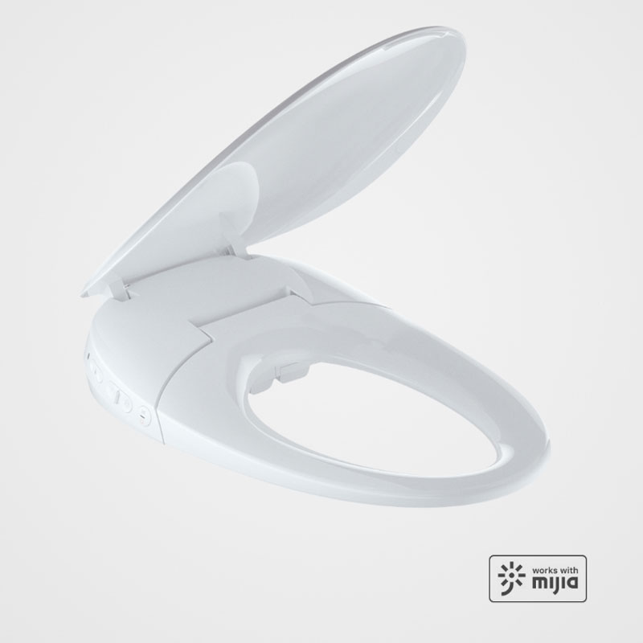
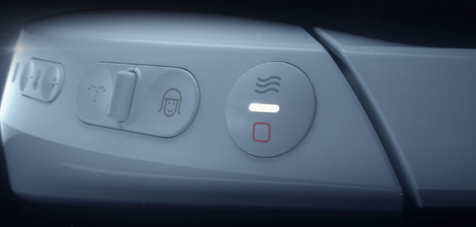
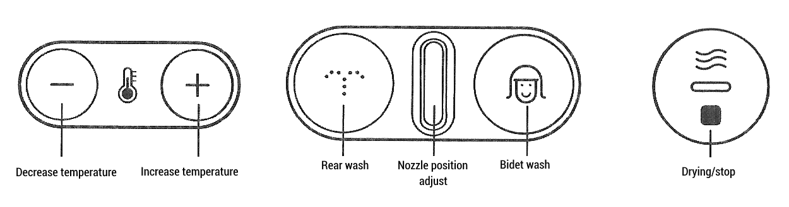

Translation of button panel instructions for Whale Spout Smart Toilet Seat Pro (LY-ST1808-008B), listed in Mi Home as `xjx.toilet.pro`. 

Available at [Banggood](https://www.banggood.com/custlink/vvDY6mHuIE).

## Operation (Quick use method) 

### 1. Seating

When the toilet lid is opened. the toilet seat will automatically sense the human body.

### 2. Select washing mode

Click on `(rear)` or `(bidet)` button; the nozzle will extend after self cleaning, and selected washing mode will be turned on.

### 3. Select massage mode

In washing mode, long press the same key to start oxygen enriched massage mode

### 4. Drying 

Click on `(stop)` button to start warm air drying.  

### 5. Stop 

Click on `(stop)` button to end drying or washing operation.  

## Key Combination Operation

### 1. Deodorize

Simultaneously press `(rear)` and `(stop)` button for 2 seconds to activate or deactivate automatic deodorization. 

### 2. Night Light 

Simultaneously press `(bidet`) and `(stop)` button for 2 seconds to activate or deactivate night light.

### 3. Manual nozzle self-cleaning

While not seated, press and hold `(rear)` and `(bidet)` button at the same time. The nozzle will move back and forth with clear water flowing. After about 20 seconds, the nozzle retracts ending self-cleaning mode.

After the user is seated, functions such as cleaning and drying will begin to work.     
After the washing or drying mode is turned on, it will automatically end after about 2 minutes.      
If the user leaves the seat, active operation will stop immediately.     
After the user leaves the seat, the deodorizing function will continue to work for 20 seconds, in order to remove the residual odor, it is normal.

## Comfort Settings 

### 1. Seat ring temperature 
The seat ring temperature is divided into three levels. When it is closed, it is at room temperature. 
After seating, the seat ring temperature will increase by one level when pressing `(+)` button. Long press the button to go to max setting. To decrease temperature by one level press `(-)` button.
After the user sits for more than 10 minutes, the seat temperature will automatically drop to a low level to avoid low-temperature burns. 

Seat temperature levels:
	1. room temperature
	2. about 32°C
	3. about 35°C
	4. about 38°C

### 2. Washing water temperature 
In wash mode, there are three levels of water temperature. 
During washing mode, `(+)` and `(-)` buttons will increase or decrease water temperature by one level.

Water temperature levels:
	1. about 35°C
	2. about 37°C
	3. about 39°C

### 3. Drying air temperature
In drying mode, there are three levels of air temperature. 
During drying mode, `(+)` and `(-)` buttons will increase or decrease air temperature by one level.

Air temperature levels:
	1. about 36°C
	2. about 43°C
	3. about 50°C

4. Nozzle adjustment 
Push the `(nozzle adjust)` button left or right to adjust nozzle position. Long press in any direction to start or pause water spraying. 

5. Nozzle spray strenght
In washing mode, press `(rear)` or `(bidet)` button to cycle through three nozzle spray strength levels.

6. WIFI 
Long press `(stop)` button for 5 seconds to reset WIFI settings.

All mentioned functions and more can be adjusted and controlled through the Mi Home app.
